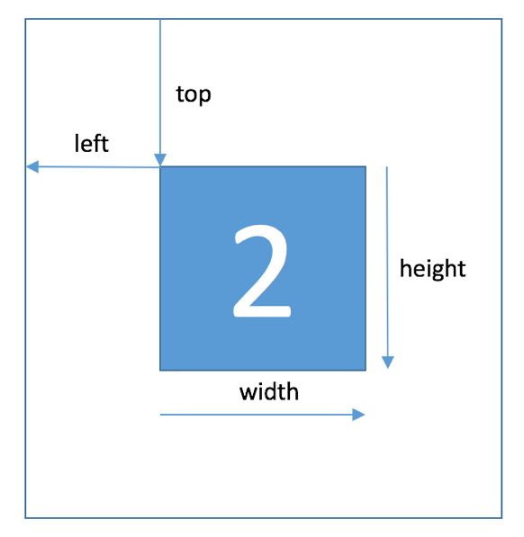

# 天池大赛 - 街景字符编码识别（YOLOv5）

成绩：

- score：0.939  
- 排名：  长期赛  3/3750


## 一、赛题解析

### 1、数据介绍

赛题来源自Google街景图像中的门牌号数据集（The Street View House Numbers Dataset, [SVHN](http://ufldl.stanford.edu/housenumbers/)），并根据一定方式采样得到比赛数据集。

数据来自真实场景的门牌号。

- 训练集数据`mchar_train`包括3W张照片，验证集`mchar_val`数据包括1W张照片，每张照片包括：颜色图像 、对应的编码类别 和 具体位置；
- 测试集A `mchar_test_a`包括4W张照片，测试集B包括4W张照片。


**字段表**

```
# 举例

# "000018.png": {"height ": [19, 19, 19], "label": [2, 2, 2], "left": [19, 28, 36], "top": [1, 1, 1], "width": [7, 7, 7]}, 

# （字符高度， 标签， 左上角坐标X， 左上角坐标Y, 字符宽度）
```

所有的数据（训练集、验证集和测试集）的标注使用JSON格式，并使用文件名进行索引。如果一个文件中包括多个字符，则使用列表将字段进行组合。

| Field  | Description |
| :----: | :---------: |
|  top   | 左上角坐标Y |
| height |  字符高度   |
|  left  | 左上角坐标X |
| width  |  字符宽度   |
| label  |  字符编码   |

字符的坐标具体如下所示：



同一张图片中可能包括一个或者多个字符

| 原始图片                              | 图片JSON标注                              |
| ------------------------------------- | ----------------------------------------- |
|  |  |


### 2、评测标准

评价标准为准确率，选手提交结果与实际图片的编码进行对比，以**编码整体识别准确率**为**评价指标**，结果越大越好，具体计算公式如下：
$$
score = \frac{编码识别正确的数量}{测试集图片数量}
$$


## 二、YOLOv5


## 1、Requirements  

1. Python 3.8
2. 其余的见 `YOLOv5/requirements.txt`


## 2、数据集

### 2.1 文件夹结构

数据集文件夹的图片数据和标注数据结构如下所示：

```
├─data
│  ├─mchar_train
│  │  ├─images
│  │  └─labels
│  └─mchar_val
│  │   ├─images
│  │   └─labels
│  ├─mchar_test_a
│  │  ├─images
│  │  └─labels
│  data.yaml
└─YOLOv5
```


### 2.2 对label的处理

YOLOv5要求一张图片一个 txt 文件， 内容如下（其中坐标的取值都是 [0, 1]）：

```text
<object-class> <x_center> <y_center> <width> <height>
```


步骤：

1. 运行`make_label.py`文件，把数据的标注的格式修改成YOLOv5的标注格式。
2. 训练的时候，在训练集和验证集加载数据的时候出问题，有错误数据，删了。
3. 把验证集的前7999张图片和对应的7999个标签，加上前缀`'val_'`后，把它们放到里训练集里。所以：
   - 训练集：37998张
   - 验证集：   2000张


## 3、Training

### 3.1 修改模型细节

1. 注释掉了数据增强里的翻转。（防止数据`6`，翻转后变成`9`等情况 ）

2. 增大了cls损失的权重。


### 3.2 训练

1. 修改数据集的配置文件`data/data.yaml`内容：
```python
train: ../data/mchar_train
val: ../data/mchar_val

nc: 10
names: ['0', '1', '2', '3', '4', '5', '6', '7', '8', '9']
```

2. 修改`yolov5/models/YOLOv5x.yaml`的内容：
```python
# number of classes
nc: 10  # number of classes
```
3. 训练：
```python
python train.py --data ../data/data.yaml --cfg models/yolov5x.yaml --weights yolov5x.pt --batch-size 4 --img-size 320 --workers 0  --multi-scale
```


## 4、Inference

1. detect：

```python
python detect.py --source ../data/mchar_test_a --weights ./runs/train/exp/weights/best.pt --save-txt --img-size 192 --conf-thres 0.3 --iou-thres 0.35
```

2. 处理输出的label：

```python
python change_label.py
```

3. 可多detect几次，做模型融合。


